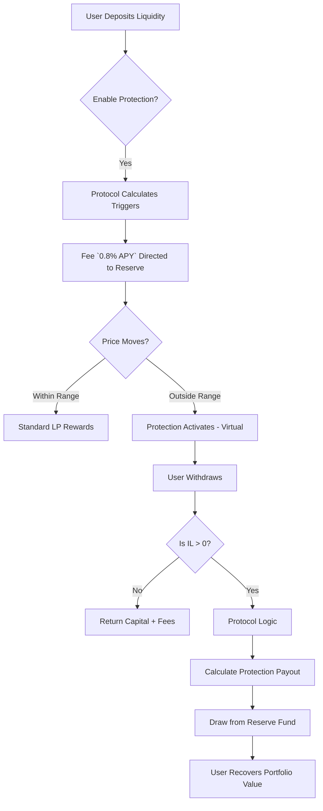
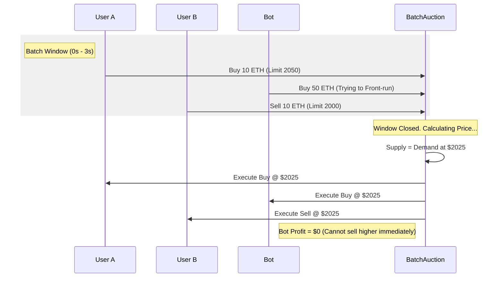
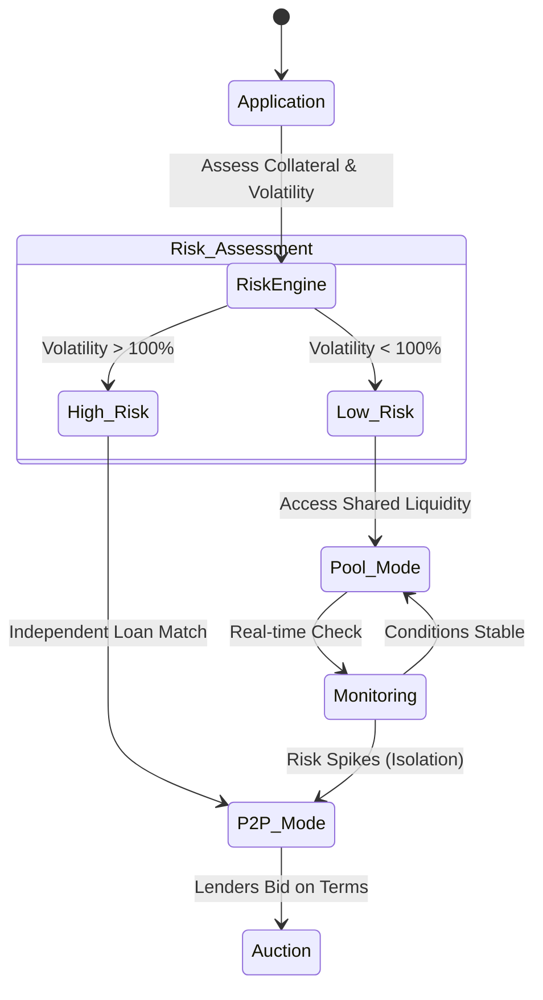
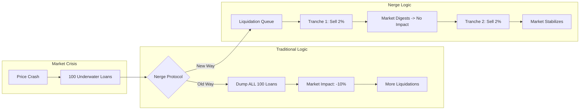

# Nerge Protocol: Light Paper v3.0

**The Future of Robust & Efficient DeFi**

## 1. Introduction: Solving DeFi's Trilemma

Decentralized Finance (DeFi) has revolutionized transparency and access, but the first generation of protocols suffers from three critical, structural flaws:

1.  **Impermanent Loss (IL)**: Liquidity Providers (LPs) blindly lose money when asset prices move.
2.  **MEV Extraction**: Traders lose millions to front-running bots and predatory block ordering.
3.  **Liquidation Cascades**: Lending markets crash violently when prices drop, as mass liquidations wipe out order books.

**Nerge Protocol** introduces "DeFi 2.0": A mathematically rigorous suite of protocols designed to solve these problems at the root level using **Adaptive Concentrated Liquidity** and **Hybrid Lending** models. Founded on Move for the Sui blockchain, Nerge brings traditional finance (TradFi) safety mechanisms to DeFi speed.

---

## 2. ACL-DEX: The End of Impermanent Loss

The **Adaptive Concentrated Liquidity DEX (ACL-DEX)** is the first exchange to treat Impermanent Loss protection not as an add-on, but as a core utility feature—like an "anti-lock brake system" for your liquidity.

### 2.1 The "SaaS" Model of Protection
Traditional IL protection requires buying complex options or insurance. Nerge replaces this with a simple subscription model:
*   **Protection as a Service**: You enable protection with a toggle.
*   **Continuous Fee**: A small fee (e.g., 0.8% APY) is deducted from your daily yields.
*   **Automatic Payout**: If you suffer IL upon withdrawal, the protocol's Reserve Fund pays the difference.

You don't need to understand options Greeks. The protocol uses **synthetic option replication** math in the background to calculate fair fees and ensure the Reserve Fund remains solvent.

#### Diagram: IL Protection Lifecycle

### 2.2 MEV-Resistant Batch Auctions
On other DEXs, "fast" traders (bots) can jump in front of your trade to force a worse price. Nerge uses **Batch Auctions** to eliminate this.

*   **The Bucket**: Orders are collected for a short window (2-3 seconds).
*   **Uniform Price**: The protocol calculates one fair clearing price for ALL buys and sells in that bucket.
*   **No Sorting**: Since everyone gets the same price, reordering transactions (front-running) yields zero profit.

#### Diagram: Creating Fair Markets via Batches

---

## 3. P2PH Lending: Stabilizing the Market

**Peer-to-Pool Hybrid (P2PH) Lending** combines the deep liquidity of pools (like Aave) with the risk isolation of P2P lending (like Morpho), secured by an anti-cascade liquidation engine.

### 3.1 Hybrid Risk Routing
Not all loans are equal. A stablecoin loan is safe; a memecoin loan is risky. P2PH separates them dynamically.
*   **Pool Tier**: Safe assets stay in the shared pool for max liquidity.
*   **P2P Tier**: If an asset becomes volatile, the protocol moves those specific loans to direct Peer-to-Peer matches. This protects the main pool from bad debt.

#### Diagram: Dynamic Hybrid Structure

### 3.2 Gradual Liquidations (Anti-Cascade)
When prices crash, standard protocols sell collateral instantly, dumping millions onto the market. This causes prices to crash further (a "Cascade").

Nerge uses **Queue-Based Gradual Liquidations**:
1.  **Queue**: Underwater positions line up.
2.  **Tranches**: The system sells small chunks (e.g., $100k) every few minutes instead of $10M at once.
3.  **Dutch Auction**: Prices start high and slowly drop until a buyer is found, ensuring the borrower pays the minimum penalty possible.

#### Diagram: The Cascade Prevention Engine

### 3.3 Byzantine Fault Tolerant Oracles
Price feeds (Oracles) are the most common attack vector. Nerge never trusts a single source.
*   **Multi-Oracle**: We aggregate prices from multiple independent sources.
*   **Weighted Median**: Extreme outliers (hacks or bugs) are mathematically ignored.
*   **Slashing**: If an oracle acts maliciously, their stake is slashed.

---

## 4. Technology Stack

Nerge is built for **Sui**, chosen for its parallel execution capabilities.
*   **Move Language**: Safe handling of assets as "objects," preventing reentrancy attacks.
*   **Parallelism**: P2PH can liquidate ETH positions and BTC positions in the same second without congestion.
*   **Reinforcement Learning (RL)**: An off-chain AI continuously optimizes interest rate curves and fee parameters to maximize protocol efficiency.

---

## 5. Tokenomics Summary

The protocol uses a dual-token model to align incentives.

| Token | Role | Utility |
| :--- | :--- | :--- |
| **NERGE** | Utility & Governance | Staking for fee discounts, Governance voting. |
| **veNERGE** | Vote-Escrowed | Lock NERGE to earn protocol revenue share (Real Yield). |

*   **Fair Launch**: No VC pre-mine dump.
*   **Sustainability**: Main revenue comes from legitimate protection fees and lending spreads, not inflationary emissions.

---

## 6. Comparison: Why Nerge?

| Feature | Uniswap V3 | Aave V3 | **Nerge Protocol** |
| :--- | :--- | :--- | :--- |
| **IL Protection** | None | N/A | **Native & Synthetic** |
| **Execution** | Sequential (MEV prone) | N/A | **Batch Auctions (MEV proof)** |
| **Liquidation** | N/A | Instant (Risk of cascade) | **Gradual (Market stable)** |
| **Oracle** | TWAP (Slow) | Chainlink (Single Dep) | **BFT Consensus (7+ sources)** |
| **Risk Model** | User Defined | Shared Pool Risk | **Hybrid Pool + P2P Isolation** |

---

*For the deep mathematical proofs and code implementation details, please refer to the [Whitepaper](white-paper.md) and [Developer Docs](developer-docs.md).*
