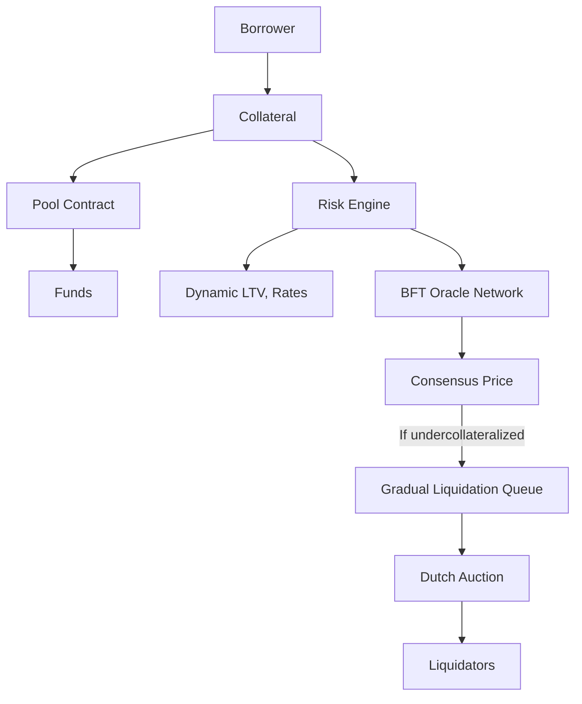
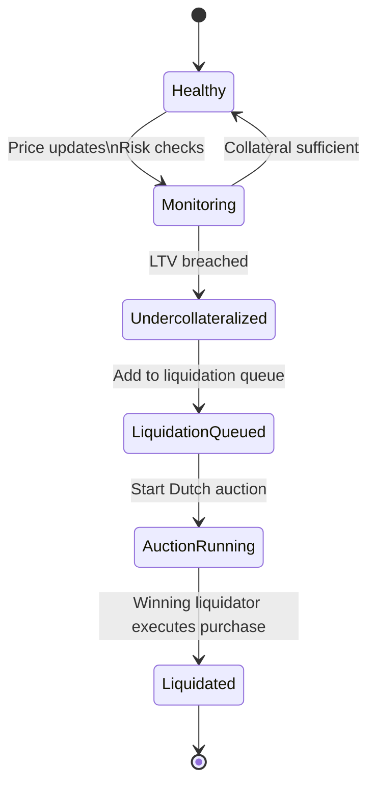
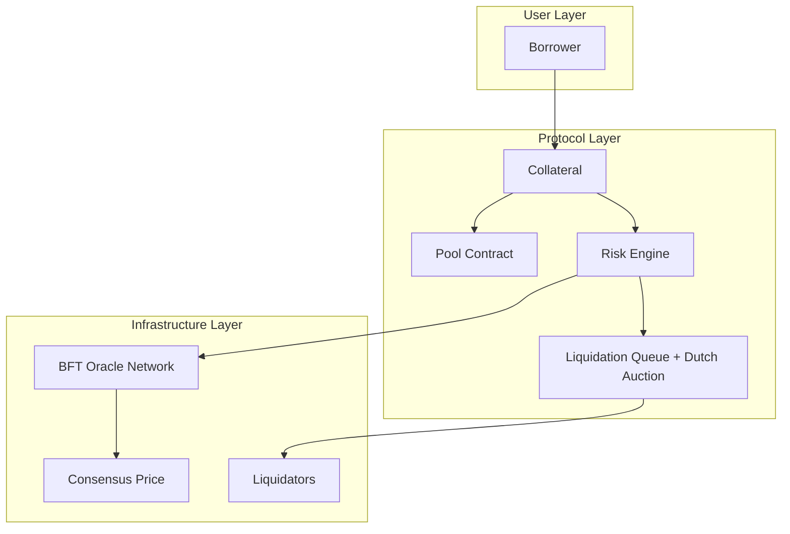
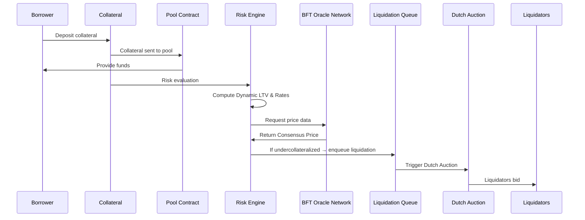

# **A Revolutionary Lending Protocol: Peer-to-Pool Hybrid Lending (P2PH)**

The P2PH protocol is **revolutionary** in multiple dimensions, it fundamentally rethinks how lending protocols should work. Let's look at it in detail.

---

## **1. Why P2PH is Revolutionary**

**Traditional Lending Protocols (Aave, Compound) have 3 major flaws:**

| Problem | Traditional Approach | Result |
|---------|---------------------|--------|
| **1. Liquidation Cascades** | Instant liquidations via auctions | Flash crashes, bad debt, systemic risk |
| **2. Oracle Risk** | Single oracle or fallback oracles | Manipulation attacks ($hundreds of millions lost) |
| **3. Static Interest Rates** | Fixed curves based on utilization | Inefficient capital allocation, arbitrage opportunities |

**P2PH's Revolutionary Solutions:**
1. **Gradual Liquidations** (prevents cascades)
2. **Byzantine Fault-Tolerant Oracle Consensus** (prevents manipulation)  
3. **Reinforcement Learning Interest Rates** (dynamic optimization)
4. **Dynamic Risk Parameters** (real-time adaptation)

---

## **2. Core Architecture: "Peer-to-Pool Hybrid"**

### **What "Hybrid" Means:**
```
Traditional Models:
- Peer-to-Peer (Match lenders/borrowers directly) → Complex, illiquid
- Pool-based (All funds in shared pool) → Simple but has above flaws

P2PH's Hybrid Approach:
- Borrowing: Pool-based (from shared liquidity pool)
- Liquidation: Peer-to-Peer (gradual Dutch auctions to market makers)
- Oracle: Byzantine consensus (multiple independent sources)
- Rates: RL-optimized (learns from market conditions)
```

### **Key Components Diagram:**
```
Borrower → [Collateral] → [Pool Contract] → [Funds]
                    ↓
              [Risk Engine] → [Dynamic LTV, Rates]
                    ↓
          [BFT Oracle Network] → [Consensus Price]
                    ↓
If undercollateralized → [Gradual Liquidation Queue]
                    ↓
              [Dutch Auction] → [Liquidators]
```








---

## **3. Detailed Breakdown of Each Innovation**

### **A. Gradual Liquidations via Queuing Theory**

**The Problem:**
Instant liquidations in Aave/Compound cause:
- **Price impact:** Large positions sold quickly → price drops
- **Cascades:** Price drop → more positions undercollateralized → more liquidations
- **Example:** March 2023 USDC depeg → $10M+ bad debt from cascades

**P2PH Solution: Model as M/M/c Queue**

**Step-by-Step Process:**

1. **Detection:**
   - Position health monitored continuously
   - When collateral ratio < liquidation threshold → enters queue

2. **Queuing System:**
   ```python
   # Parameters from whitepaper
   λ = arrival rate (Poisson) of undercollateralized positions
   μ = service rate per liquidation channel
   c = number of parallel liquidation channels
   
   # Stability condition (Theorem 2.7):
   ρ = λ/(cμ) < 1  # System stable
   
   # Expected queue time:
   W_q = P₀/(cμ - λ)  # P₀ = probability empty queue
   ```

3. **Gradual Execution via Dutch Auctions:**
   - Instead of dumping all collateral at once
   - Split into `n` tranches (Theorem 2.8)
   - Sell via declining price Dutch auction:
     $$
     P(t) = P_{\text{oracle}} \cdot e^{-\alpha t} + P_{\text{floor}}
     $$
   - Each tranche sold separately over time

4. **Optimal Tranche Size (Theorem 2.9):**
   $$
   V_i^* = \sqrt{\frac{2rL}{kn}}
   $$
   Where:
   - `r` = borrowing rate
   - `L` = market liquidity depth  
   - `k` = price impact coefficient
   - `n` = number of tranches

**Example: $10M ETH Position Liquidation**
```
Traditional Protocol:
  - Dump $10M ETH instantly
  - Price impact: 5-10%
  - Triggers other liquidations
  
P2PH:
  - Split into n = 5 tranches of $2M each
  - Sell via Dutch auctions over 2 hours
  - Price impact per tranche: 1-2%
  - No cascade triggered
```

### **B. Byzantine Fault-Tolerant Oracle Consensus**

**The Problem:**
- Single oracles (Chainlink) can fail or be manipulated
- Historical attacks: bZx ($55M), CREAM ($130M), Mango Markets ($114M)

**P2PH Solution: Stake-Weighted Median + Commit-Reveal**

**Three-Layer Protection:**

**Layer 1: Multi-Oracle Aggregation**
- Use 7+ independent oracle providers
- **Stake-weighted median** (not mean!):
  $${
  P_{\text{consensus}} = \text{Median}_{\text{weighted}}(\{(P_i, s_i)\})
  }$$
- Byzantine oracles with <50% stake cannot move median outside honest range (Theorem 2.10)

**Layer 2: Statistical Outlier Detection**
- Report is outlier if:
  $$
  |P_i - P_{\text{consensus}}| > 3σ
  $$
- Quadratic slashing:
  $$
  \text{Slash}(d) = \min(s_i, κ \cdot d^2)
  $$

**Layer 3: Commit-Reveal Scheme**
```
Phase 1 (Commit): 
  cᵢ = H(Pᵢ || rᵢ || t)  # Hash of price + nonce
  
Phase 2 (Reveal): 
  Reveal (Pᵢ, rᵢ) such that H(Pᵢ || rᵢ || t) = cᵢ
```
- Prevents adaptive attacks (Theorem 2.12)

**Manipulation Cost Analysis (Theorem 5.3):**
To move price by δ = 5% with f = 40% of stake:
$$
\text{Cost} = κ \cdot \left(\frac{1-f}{f}\right)^2 δ^2 \cdot S ≈ \$28M
$$
Makes attacks economically irrational.

### **C. Reinforcement Learning for Interest Rates**

**The Problem:**
Static curves like:
$$
r(U) = r₀ + r₁·U + r₂·\max(U - U^*, 0)
$$
Don't adapt to:
- Market regime changes (bull/bear)
- Competitor rates
- Asset-specific volatility
- Black swan events

**P2PH Solution: Q-Learning Based Dynamic Rates**

**1. State Space (Definition 3.1):**
$$
s_t = (U_t, σ_t, r_t^{\text{market}}, R_t^{\text{protocol}}, D_t)
$$
- Utilization rate
- Recent volatility (EWMA)
- Market lending rates (from competitors)
- Protocol reserve ratio
- Recent bad debt

**2. Action Space:**
$$
a_t = (r₀^t, r₁^t, r₂^t, U^{*,t})
$$
Interest rate curve parameters + optimal utilization target

**3. Reward Function (Maximize):**
$$
R(s_t, a_t) = w₁·\text{Revenue}_t + w₂·U_t - w₃·\text{BadDebt}_t - w₄·|\Delta r_t|
$$
Balance: revenue + utilization vs. bad debt + rate volatility

**4. Q-Learning Update:**
```
Initialize Q(s,a)
For each time step t:
  Choose action a (ε-greedy exploration)
  Execute, observe reward r, next state s'
  Update: Q(s,a) ← Q(s,a) + α[r + γ·maxₐ' Q(s',a') - Q(s,a)]
```

**Convergence Guarantee (Theorem 3.1):**
Under standard conditions, converges to optimal policy with probability 1.

**Real-World Behavior:**
```
Market Condition → RL Response
--------------------------------
High volatility → Higher rates, lower LTVs
Low utilization → Lower rates to attract borrowers
Competitor lowers rates → Match strategically
Black swan event → Drastically increase rates, pause borrowing
```

### **D. Dynamic Risk Parameters**

**Traditional:** Static LTV ratios (e.g., ETH = 75%, BTC = 70%)

**P2PH:** Real-time adjusted LTV:   
$$\text{LTV}_i(t) = \text{LTV}_{\max} \cdot \left(1 - \frac{σ_i(t)}{σ_{\max}}\right) \cdot \left(1 - \frac{\text{Util}_i(t)}{\text{Util}_{\max}}\right)$$

**Example: ETH Volatility Spike**
```
Normal: σ = 60%, Util = 40%
  LTV = 0.75 × (1 - 60/200) × (1 - 40/80) = 0.75 × 0.7 × 0.5 = 26.25%

Volatility spike: σ = 180%, Util = 70%
  LTV = 0.75 × (1 - 180/200) × (1 - 70/80) = 0.75 × 0.1 × 0.125 = 0.94%
  
Result: During crisis, borrowing against ETH nearly stops
```

**Solvency Proof (Theorem 3.7):**
With:
$$
\text{LTV} < \frac{1}{1 + 3σ\sqrt{Δt}}
$$
Protocol remains solvent with >99.7% probability (3-sigma events).

---

## **4. Implementation on Sui**

**Move Language Advantages:**
```rust
// Position as NFT with embedded risk parameters
struct LoanPosition has key, store {
    id: UID,
    collateral: Balance<COLLATERAL>,
    debt: Balance<DEBT>,
    owner: address,
    risk_score: u64,  // Dynamic based on volatility/util
    liquidation_queue_id: Option<UID>,  // If in liquidation queue
}

// Liquidation queue as shared object
struct LiquidationQueue has key {
    id: UID,
    positions: vector<UID>,
    current_auction: Option<Auction>,
    tranche_index: u64,
}
```

**Parallel Execution Benefits:**  
- Liquidations process in parallel (different assets)   
- Oracle updates don't block borrowing  
- Multiple borrowers can interact simultaneously  

---

## **5. Economic Effects and Incentives**   

### **For Borrowers:**
- **Lower liquidation risk** (gradual vs instant)   
- **Fairer liquidations** (Dutch auction finds true market price)   
- **Dynamic rates** (potentially lower during normal times)

### **For Liquidators:**  
- **Predictable profits** (Dutch auction eliminates gas wars)   
- **Reduced risk** (smaller tranches, less price impact)   
- **Professional market makers preferred** (not bots)

### **For Lenders:**  
- **Higher safety** (cascade prevention, better oracles)   
- **Better yields** (RL optimizes revenue)   
- **Transparent risk** (real-time LTV adjustments)

---

## **6. Comparison with Existing Protocols**

| Feature | Aave/Compound | P2PH |
|---------|--------------|------|
| **Liquidation** | Instant auctions | Gradual queue + Dutch auctions |
| **Oracle** | Chainlink primary + fallback | BFT multi-oracle consensus |
| **Interest Rates** | Static curve | RL-optimized dynamic |
| **LTV Ratios** | Fixed per asset | Dynamic based on volatility/util |
| **Cascade Risk** | High (proven by events) | Low (mathematically proven) |
| **Gas Efficiency** | High per liquidation | Lower (batch processing) |
| **MEV in Liquidations** | High (front-running) | Low (Dutch auction) |

---

## **7. Mathematical Guarantees**

**Theorem 2.8 (Cascade Prevention):**

If \( n > \frac{kV}{θ_{\text{trigger}} L} \), cascades prevented.

**Theorem 2.10 (Oracle Manipulation Resistance):**
Byzantine oracles with <50% stake cannot move consensus outside honest range.

**Theorem 3.7 (Solvency Preservation):**
With dynamic LTV, protocol solvent with >99.7% probability.

**Theorem 5.4 (Cascade Probability Bound):**
$$
\Pr[\text{cascade}] < Φ\left(-\frac{θ_{\text{trigger}}\sqrt{n}}{σ\sqrt{Δt}}\right)
$$
For typical parameters: <0.1% probability.

---

## **8. Real-World Impact Examples**

**Scenario 1: ETH Flash Crash (-30% in 1 hour)**
```
Aave/Compound:
  - Mass liquidations triggered
  - Price impact amplifies crash
  - Bad debt created
  - Protocol may need bailout

P2PH:
  - LTVs automatically decrease as volatility spikes
  - Fewer positions enter liquidation
  - Those that do liquidate gradually
  - No cascade, minimal bad debt
```

**Scenario 2: Oracle Attack Attempt**
```
Traditional:
  - Attacker manipulates single oracle
  - Triggers false liquidations
  - Steals collateral
  
P2PH:
  - Needs to manipulate >50% of stake-weighted oracles
  - Cost: $28M+ for 5% price move
  - Economically irrational
```

---

## **9. Limitations and Mitigations**

| Risk | Mitigation |
|------|------------|
| **RL Training Period** | Start with conservative static rates, learn gradually |
| **Oracle Collusion** | Diverse oracle providers, large slashing penalties |
| **Dutch Auction Failure** | Fallback to batch auction with guaranteed minimum |
| **Queue Congestion** | Dynamic channel scaling, priority fees |
| **Black Swan Events** | Circuit breakers, emergency pause, insurance fund |

---

## **10. Why This Is Revolutionary**

1. **First mathematically proven** cascade prevention
2. **First BFT oracle consensus** in lending (not just DEX)
3. **First RL-optimized rates** (autonomous market making)
4. **Solves the 3 biggest problems** in lending simultaneously
5. **Could prevent billions** in future bad debt and attacks

**The Innovation Stack:**
```
Layer 1: Queuing Theory → Gradual Liquidations
Layer 2: Game Theory → Oracle Consensus
Layer 3: Reinforcement Learning → Dynamic Rates  
Layer 4: Stochastic Calculus → Dynamic Risk Parameters
Layer 5: Move Language → Provable Safety
```

---

**Bottom Line:** P2PH isn't an incremental improvement—it's a **fundamental redesign** of lending protocols using **cross-disciplinary mathematical frameworks** to solve problems that have plagued DeFi for years.

This is what **next-generation DeFi** looks like: not just copying TradFi with blockchain, but using advanced mathematics and computer science to create systems that are **inherently safer and more efficient** than anything possible in traditional finance.