

# **NERGE PROTOCOL — LIGHT PAPER**  
### *A Next‑Generation DeFi Infrastructure for Safer, Fairer, and More Efficient Markets*

---

## **1. Overview**

Decentralized Finance has grown into a global financial ecosystem, yet core infrastructure still suffers from structural weaknesses: impermanent loss, MEV extraction, liquidation cascades, and oracle manipulation. These issues erode user trust and limit institutional adoption.

**Nerge Protocol** introduces two mathematically‑engineered systems designed to solve these problems at their root:

- **ACL‑DEX** — an Adaptive Concentrated Liquidity DEX with built‑in impermanent loss protection and MEV‑resistant batch auctions  
- **P2PH Lending** — a Peer‑to‑Pool Hybrid lending protocol with gradual liquidations and Byzantine‑resistant oracle consensus  

Together, they form a unified, secure, and capital‑efficient DeFi ecosystem built on the Sui blockchain.

---
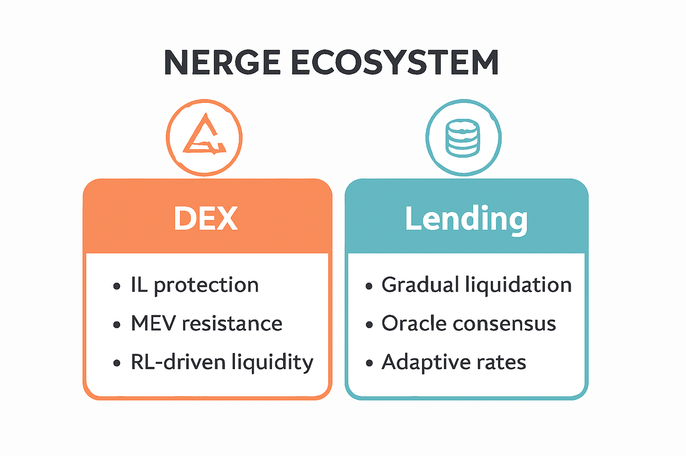

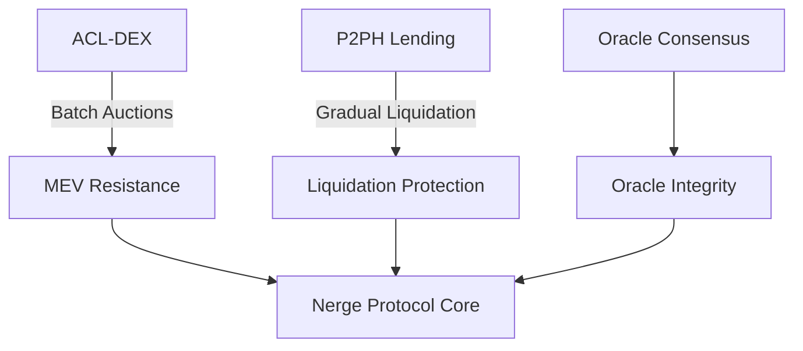
---

## **2. ACL‑DEX: Adaptive Concentrated Liquidity DEX**

ACL‑DEX is designed to eliminate the two biggest risks for liquidity providers: **impermanent loss** and **MEV attacks**.

### **2.1 Impermanent Loss Protection (ILP)**

Traditional AMMs expose LPs to losses when asset prices diverge. ACL‑DEX solves this through **synthetic payoff replication**, using a protocol reserve fund to automatically compensate LPs at withdrawal.

This is **not** an options market. No options are issued, traded, or exercised. Instead:

- Mathematical models (Black‑Scholes, Merton Jump‑Diffusion) determine protection parameters  
- LPs pay a small continuous fee  
- The protocol reserve pays out protection automatically  

This transforms liquidity provision from a speculative activity into a predictable yield strategy.

#### igure 2A: IL Protection Flow

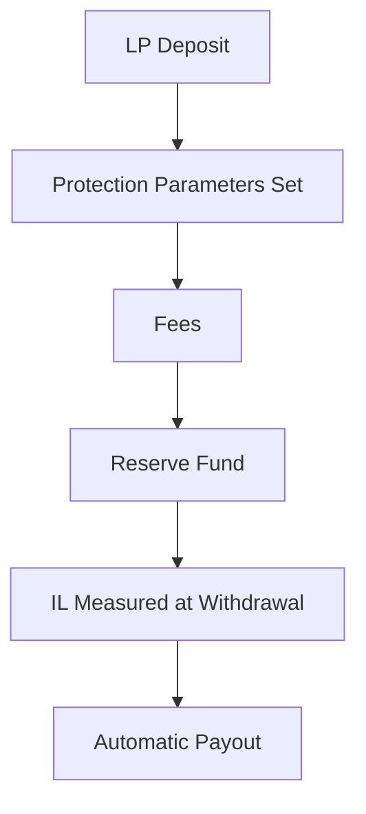
---
#### Figure 2B: IL Protection Flow

---

### **2.2 MEV‑Resistant Batch Auctions**

Instead of processing trades sequentially (which enables front‑running and sandwich attacks), ACL‑DEX uses **uniform‑price batch auctions**:

- All trades in a short interval are executed simultaneously  
- Everyone receives the same clearing price  
- Transaction ordering becomes irrelevant  

This eliminates MEV extraction and reduces slippage for all traders.

---
#### Figure 3: Batch Auction Mechanism
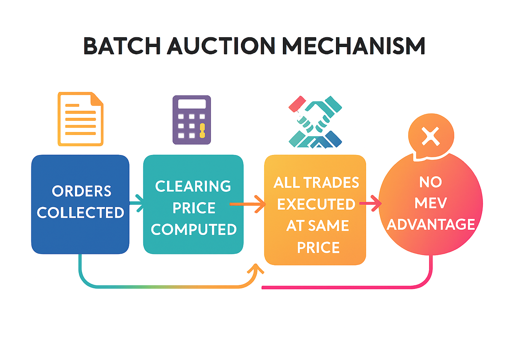

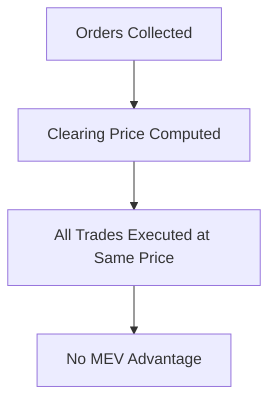
---

### **2.3 Adaptive Liquidity via Reinforcement Learning**

ACL‑DEX uses reinforcement learning to dynamically adjust liquidity concentration ranges based on:

- Volatility  
- Volume  
- Price trends  
- Historical LP performance  

This ensures deeper liquidity where it matters most, improving capital efficiency and reducing LP risk.

---

## **3. P2PH Lending: Peer‑to‑Pool Hybrid Lending**

P2PH Lending introduces a safer, more predictable lending market through three innovations.

### **3.1 Gradual Liquidations**

Instead of liquidating positions instantly (which causes cascades and market crashes), Nerge uses:

- **Tranche‑based liquidation**  
- **Dutch auction price curves**  
- **Queue‑based execution**  

This spreads liquidation volume over time, minimizing price impact and preventing systemic failures.

---
#### Figure 4: Gradual Liquidation Queue

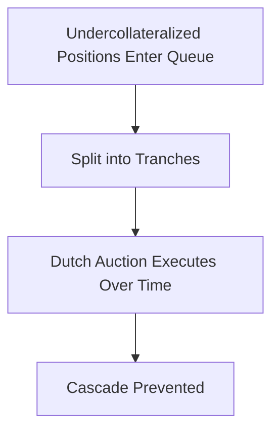
---

### **3.2 Byzantine‑Resistant Oracle Consensus**

Nerge aggregates price data using a **stake‑weighted median**, ensuring:

- Manipulation resistance  
- Protection against collusion  
- Stability even if up to 1/3 of oracles are malicious  

Outliers are automatically detected and penalized through quadratic slashing.

---

#### Figure 5: Oracle Consensus Flow

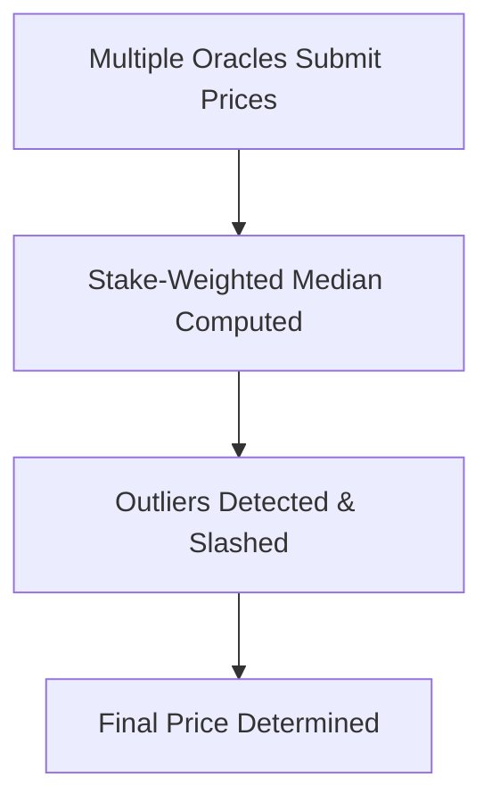
---

### **3.3 Adaptive Interest Rates**

Instead of static curves, Nerge uses reinforcement learning to adjust interest rates based on:

- Utilization  
- Market volatility  
- Liquidity conditions  
- Historical borrower behavior  

This ensures optimal capital allocation and stable yields.

---

## **4. Tokenomics**

Nerge uses a **dual‑token architecture** designed for long‑term sustainability.

### **4.1 Utility Token**
Used for:
- Paying protocol fees  
- Staking  
- Liquidity incentives  
- Oracle participation  

### **4.2 Governance Token (ve‑Model)**  
Users lock governance tokens to receive:
- Voting power  
- Boosted rewards  
- Long‑term alignment incentives  

### **4.3 Value Accrual**
Protocol fees flow to:
- IL protection reserve  
- Buyback & burn mechanisms  
- Treasury growth  
- Governance incentives  

---

#### Diagram 6: Token Flow & Value Accrual 
Fees → reserve → treasury → governance → incentives → LPs/lenders.

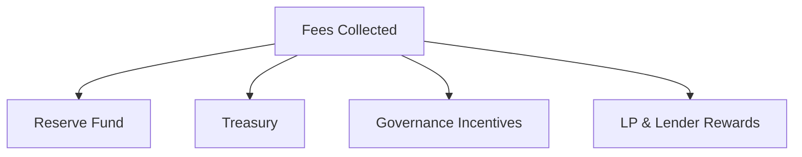
---

## **5. Security Architecture**

Nerge’s security model is built on three pillars:

### **5.1 MEV Resistance**
Batch auctions eliminate ordering‑based attacks.

### **5.2 Cascade Prevention**
Gradual liquidation prevents mass liquidations and market crashes.

### **5.3 Oracle Manipulation Resistance**
Stake‑weighted median + slashing ensures robust price feeds.

---

### Security Pillars

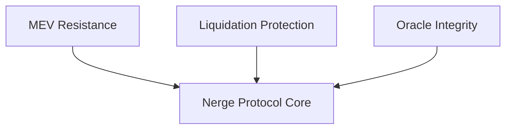
---

## **6. Implementation on Sui**

Nerge is built on the **Sui blockchain**, leveraging:

- **Parallel execution** for high throughput  
- **Object‑centric architecture** for clean state management  
- **Sub‑second finality** enabling 2–3 second batch auctions  
- **Move language** for safety‑first smart contract design  

This ensures scalability, security, and low‑latency user experience.

---

### Technology Stack
Sui → Move → Nerge Protocols → DEX + Lending + Governance.

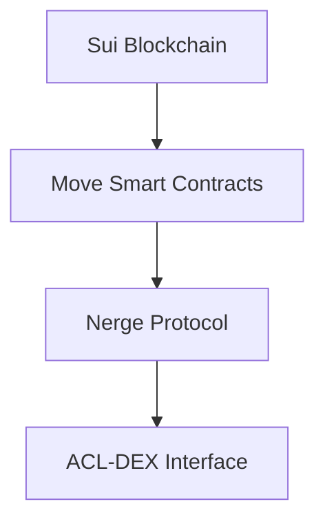
---

## **7. Roadmap**

### **Phase 1 — ACL‑DEX Launch**
- IL protection  
- Batch auctions  
- RL‑driven liquidity  

### **Phase 2 — P2PH Lending**
- Gradual liquidations  
- Oracle consensus  
- Adaptive rates  

### **Phase 3 — Treasury Optimization**
- Portfolio optimization  
- Dynamic risk parameters  

### **Phase 4 — Governance Expansion**
- DAO launch  
- ve‑token voting  
- Community‑driven upgrades  

---

### ** Roadmap Timeline**    
Four phases with icons and milestones.

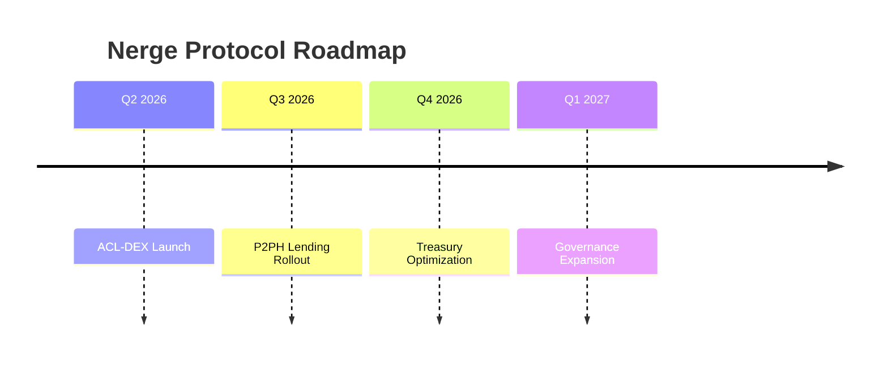
---

## **8. Conclusion**

Nerge Protocol combines rigorous mathematical foundations with practical DeFi engineering to deliver:

- Safer liquidity provision  
- Fairer trading  
- More stable lending markets  
- Stronger oracle security  
- Sustainable token economics  

It represents a new generation of DeFi infrastructure — one built not on speculation, but on **mathematical integrity, economic resilience, and user protection**.

---
